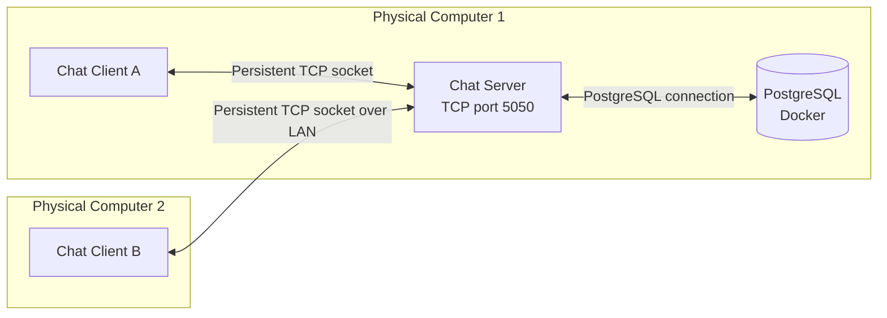

# Part 1 — System Architecture Design

## R1: System architecture

The chat application uses a **centralized client-server architecture**. One server accepts and manages connections from multiple clients. For the required demonstration, Client A and Client B run on two different physical computers connected to the same LAN. The server can run on Client A's computer, as shown below, or on a third computer without changing the design.



Example demonstration configuration:

| Component | Physical machine | Address used |
|---|---|---|
| Chat server | Computer 1 | Computer 1's private LAN IPv4 address, TCP port `5050` |
| Client A | Computer 1 | Server LAN address and port `5050` |
| Client B | Computer 2 | Server LAN address and port `5050` |

Before the demonstration, replace “Computer 1's private LAN IPv4 address” with the server's actual address, such as `192.168.1.10`. The server binds to `0.0.0.0:5050` so it can accept connections from other computers, while each client connects to the server's actual LAN address—not `127.0.0.1`.

### Responsibilities of each component

**Chat clients**

- Ask the user for a unique name and establish a persistent socket connection to the server.
- Send user actions and chat messages to the server.
- Receive server events and show connected users, groups, private rooms, group rooms, and messages.

**Chat server**

- Listens for and accepts client socket connections.
- Maintains the connected-client list and verifies that names are unique.
- Maintains private rooms, groups, and group membership.
- Persists users, groups, memberships, and message history in PostgreSQL.
- Routes a private message only to its sender and receiver.
- Routes a group message only to the clients who joined that group.
- Removes disconnected clients and broadcasts updated state.

The server is the authority for shared state. Clients do not connect directly to one another. This makes access control and message routing consistent and gives every connected client the same view of users and groups.

## Network protocols used

### 1. Ethernet or Wi-Fi (link layer)

**What it is:** Ethernet and Wi-Fi carry frames between devices on the local network.

**Why selected:** The two required physical computers need a real network connection. Both technologies are widely available and require no special hardware or cloud deployment.

**How used:** Computer 1 and Computer 2 connect to the same router or access point. Their operating systems use Ethernet or Wi-Fi underneath the socket application; the application does not manually construct link-layer frames.

### 2. IPv4 (network layer)

**What it is:** IP provides addressing and routes packets from a client computer to the server computer.

**Why selected:** Each physical computer needs a distinct network address, and IPv4 is supported by Python sockets and typical LANs.

**How used:** Clients identify the server by its LAN IPv4 address. The operating system places TCP segments in IP packets and delivers them between the two computers.

### 3. TCP (transport layer)

**What it is:** TCP provides a connection-oriented, reliable, ordered byte stream between each client and the server.

**Why selected:** Chat messages must arrive completely and in order. TCP handles retransmission, duplicate suppression, ordering, and flow control, so the application does not need to implement these mechanisms itself. UDP was not selected because it can lose, duplicate, or reorder datagrams.

**How used:** The server creates a TCP socket, binds it to port `5050`, listens, and accepts one connection per client. Each client creates a TCP socket and connects to the server. The connection remains open for sending and receiving events in both directions until the user exits or the connection fails.

### 4. Custom chat application protocol over TCP

**What it is:** A small application-level protocol defines the meaning and format of data sent through the TCP byte stream.

**Why selected:** TCP transports bytes but does not define where one chat message ends or what a message means. A custom protocol keeps the project simple and satisfies the requirement to use socket programming instead of HTTP, WebSocket, or Socket.IO.

**How used:** Each application message is encoded as UTF-8 JSON and framed with a fixed-size length header before it is passed to `socket.sendall()`. The receiver first reads the length and then reads exactly that many payload bytes. A message includes a `type` field and the fields needed by that operation. Examples include:

```json
{"type":"register","name":"Alice"}
{"type":"private_message","to":"Bob","text":"Hello"}
{"type":"join_group","group":"Networks"}
{"type":"group_message","group":"Networks","text":"Hi everyone"}
```

Length-prefixed framing is necessary because TCP is a byte stream: one `recv()` call is not guaranteed to correspond to exactly one `sendall()` call.

### 5. PostgreSQL protocol (server-to-database)

**What it is:** The PostgreSQL wire protocol carries parameterized SQL queries between the Node.js server and the PostgreSQL container.

**Why selected:** Durable storage allows groups, memberships, and authorized message history to survive disconnects and server restarts.

**How used:** Only the central server accesses PostgreSQL through the `pg` driver. Clients never connect to the database, and chat delivery between clients and the server still uses only the custom TCP socket protocol.

## R2: Socket-programming-only message path

All chat messages travel through the persistent TCP sockets between each client and the central server:

```text
Private message: Client A -> TCP socket -> Server -> TCP socket -> Client B
Group message:   Client A -> TCP socket -> Server -> TCP sockets -> joined members
```

The application does **not** use HTTP requests, REST APIs, WebSocket, Socket.IO, a database messaging service, or files to exchange chat messages. The client and server use the operating system's TCP socket API directly. JSON is only the payload format inside the socket connection; it is not a separate transport mechanism.

## Short presentation script

“Our project uses a centralized client-server architecture. During the demonstration, at least two clients run on two different physical computers. Each client establishes a persistent TCP socket connection to the server on port 5050. Ethernet or Wi-Fi connects the computers on the LAN, IPv4 identifies and routes between the computers, and TCP was chosen because chat messages need reliable, ordered delivery. On top of TCP, we use a small length-prefixed JSON protocol so the receiver can identify complete messages and their operations. The server manages users, rooms, and group membership, and routes private or group messages only to authorized recipients. Every chat message is exchanged using the TCP socket API only; we do not use HTTP, WebSocket, Socket.IO, or file-based messaging.”

## Demonstration checklist

- Run Client A and Client B on two different physical computers.
- Put both computers on the same network and confirm that Client B can reach the server computer.
- Allow inbound TCP port `5050` through the server computer's firewall if required.
- Start the server before the clients.
- Configure both clients with the server computer's actual LAN IPv4 address.
- Show that both clients have independent TCP connections to the server.
- Explain the four protocol layers and trace one private or group message through the server.
